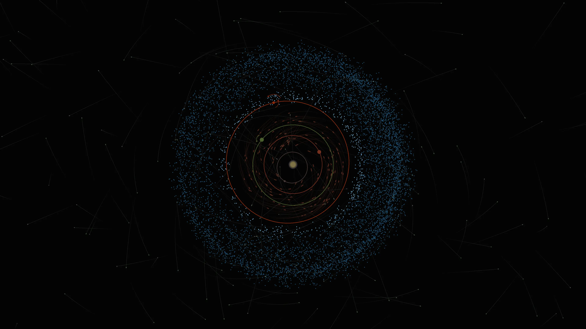

# Solar Paper

[](https://github.com/DenizUgur/solarpaper/actions/workflows/collect.yml)

Solar Paper is a project that aims to illustrate the current state of the solar system as close as possible. List of object being displayed are given below.

- Sun
- Planets
  - Mercury
  - Venus
  - Earth
  - Mars
- Moons
  - Luna (Earth)
  - Phobos (Mars)
  - Deimos (Mars)
- Spacecrafts
- Asteroids
- Comets

> Note: **Except** for the Sun and moons, everything is displayed accurately to scale.

## How it works

The project is divided into two parts. The first part is the data collection. The data is collected from [NASA's JPL HORIZONS](https://ssd.jpl.nasa.gov/?horizons) and [NASA's JPL Small-Body Database](https://ssd.jpl.nasa.gov/sbdb.cgi). The collector script processes these data and generates a special file (called SSO) that contains all the data needed to draw the objects.

> Asteroid and comet trajectories are calculated using [Poliastro](https://docs.poliastro.space/en/stable/). Using the data from Small-Body Database, a two-body problem is solved to get the trajectory of the object.

The second part is the drawing. The drawing is done using [Blend2D](https://blend2d.com/). The SSO file is read and the objects are drawn on the screen.

## How to run

Since the data acquisition is done over GitHub Actions, you don't need to run the collector script. However, if you want to run it, you can do so by running the following command:

```bash
cd ./collector
pip install poetry
poetry install
poetry run python main.py --update-db
```

This creates a cache folder at `~/.cache/solarpaper` and generates the SSO file at `~/.cache/solarpaper/orbits.sso.gz`.

To run the drawing script, you need to install [CMake](https://cmake.org/). The C++ program uses Boost, cURL, and Blend2D. You can install these libraries following the instructions on their websites. After installing the dependencies, you can run the following commands:

```bash
cd ./renderer/app
cmake --build .
./solarpaper.out
```

This creates a PNG file at `./renderer/app/output-<timestamp>.png`.

## Sample output



## License

This project is licensed under the GPT-3 License. See the [LICENSE](LICENSE) file for details.
